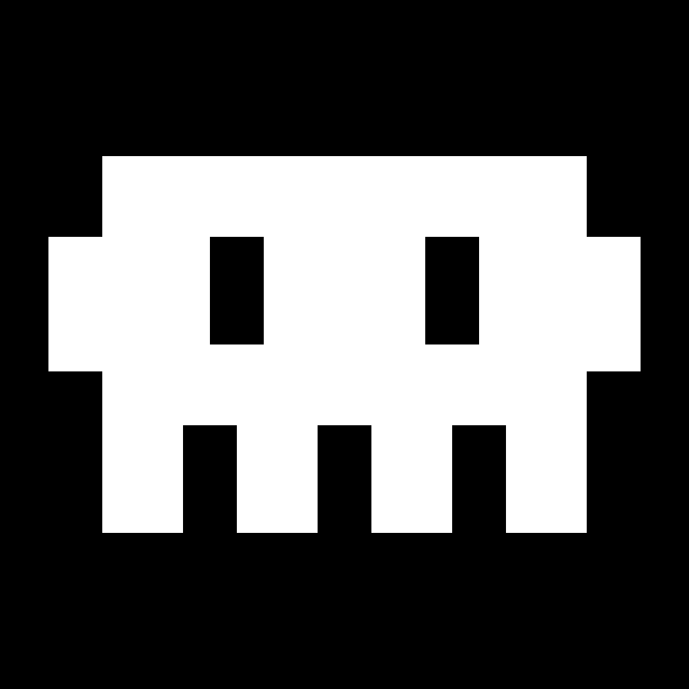
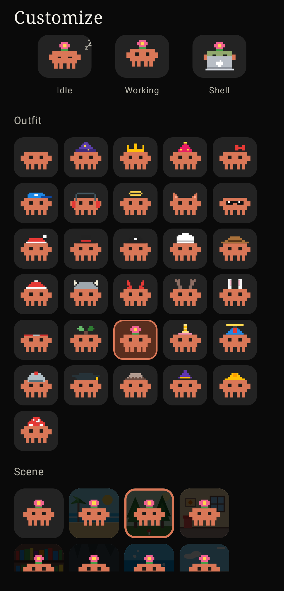

<p align="center">
  
</p>

<h1 align="center">Claude Chat</h1>

<p align="center"><b>Claude Code for Android.</b><br>Run Claude Code on your phone and talk to it like a messenger.</p>

Claude Chat is Claude Code on Android. The real `claude` CLI runs on your phone, inside a proot Ubuntu in Termux, and Claude Chat gives it a normal messaging UI: several chats, replies, attachments, a folder picker for your project. The answers, the tools and the permissions are Claude Code's own, so it reads and edits your project files, runs commands and builds your apps, all on the phone.

<p align="center">
  
  
  
  
</p>

## What it does

- Chat UI with several chats running at the same time
- A small bridge that connects the app to Claude Code in Termux
- The mascot shows what Claude is doing: idle, working, at its laptop while a command runs, asleep
- A camera pill, a line or a curtain for the status, and a floating buddy that walks around on top of every app. They can run together; the mascot lives in one of them and you drag it between the two
- Tap the mascot and a small chat bubble opens over whatever you are doing. Back closes it and you carry on with the phone
- Builds show the real time they have been running, not an invented percentage
- Black screen (AOD style) with clock, status and the last line of output
- Each chat keeps its own model. Changing the model in one chat does not change the others
- The customize sheet shows the real thing for each option (bubbles, backgrounds, pill colour), with no captions
- Several providers: Claude, GitHub Models, and free models that need no key, all picked from the same list
- Material You, AMOLED black option, English by default with Türkçe in Settings

## Getting started

Claude Chat sets Claude Code up for you; you do not need any other app first.

1. **Termux** is downloaded inside the app (open source, from its GitHub release) and handed to Android's installer.
2. **One short paste.** The app copies a single line and opens Termux. Paste it and press Enter: it installs Ubuntu and Claude Code and starts the connection. It is safe to run again, so it doubles as the repair button.
3. **Sign in to Claude** opens Claude's sign-in page in your phone's browser. Approve and come back; there is no code to copy.
4. **GitHub** (optional) works the same way, with the short code copied for you.
5. **Pick your project folder** and start writing.

From then on, tapping *Start Claude* connects in one go.

## The mascot

The mascot has an idle, a working, a laptop and a sleeping look, with dozens of outfits, scenes and body colours. It shows in the pill, the notification, the chat header and as the floating buddy.

- **Pill and buddy together.** Settings > Pill & overlay. There is one mascot, either in the pill or out walking.
- **Pull it out, put it back.** The pill sits over the status bar, where touches often never arrive, so a thin invisible strip right under it takes the drag: pull the mascot out of the pill with it, and let the buddy go on the pill or the strip to put it back. The strip can be turned off or made visible.

## Build

```bash
gradle assembleRelease
```

The APK ends up in `app/build/outputs/apk/release/`.

## Developer

xUmutKx
