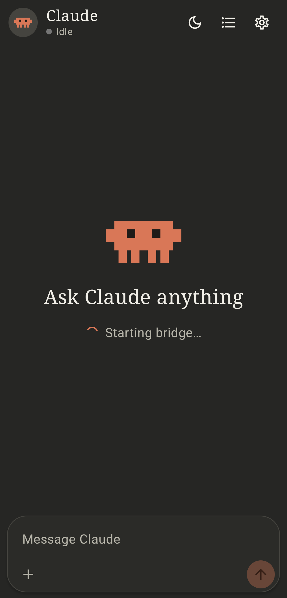
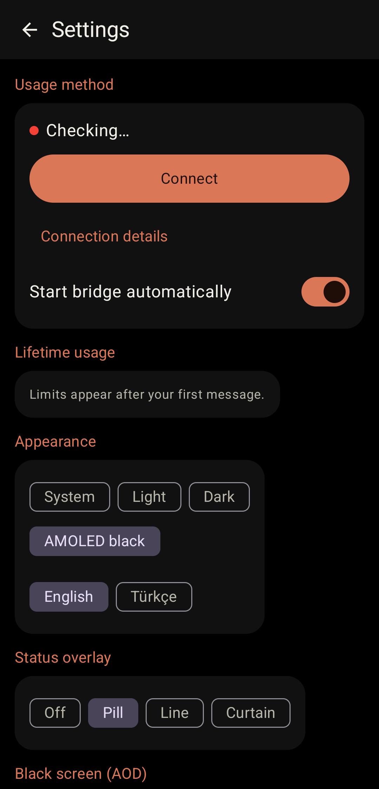
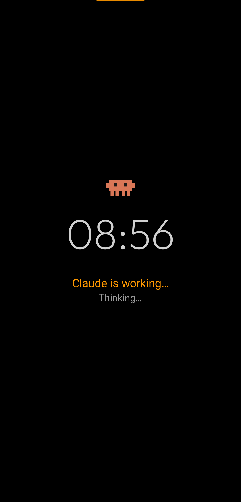

# Claude Chat

**An Android chat app for Claude Code.**

It's a messaging-style app for Claude Code. It talks to the `claude` CLI running in a proot Ubuntu inside Termux, so you get a normal messaging UI while the answers are still Claude Code's.

<p>
  
  
  
</p>

## What it does

- Chat UI with several chats running at the same time
- A small bridge that connects the app to Claude Code in Termux
- Status overlay (pill, line or curtain) that shows whether Claude is working, done or offline
- Black screen (AOD style) with clock, status and the last line of output
- The mascot dances while Claude is working, in the notification, the overlay and the chat
- Material You, AMOLED black option, English by default with Türkçe in Settings

## Build

```bash
gradle assembleRelease
```

The APK ends up in `app/build/outputs/apk/release/`.

## Developer

xUmutKx
